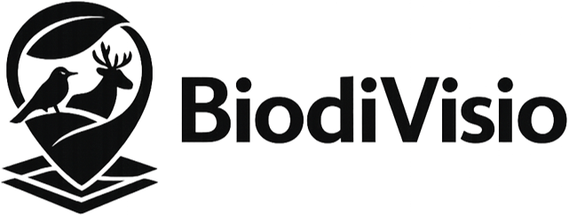

<p align="center">
  
</p>

**BiodiVisio** est une application mobile open-source conçue pour la visualisation, l'exploration et la synthèse des données naturalistes issues des instances [GeoNature](https://geonature.fr).

L'application permet aux acteurs de la biodiversité d'accéder à la connaissance naturaliste directement sur le terrain via leur smartphone, grâce à une interface cartographique fluide et des outils de recherche avancés.

<p align="center">
  <a href="https://play.google.com/store/apps/details?id=fr.otuseco.biodivisio" target="_blank">
    
  </a>
  &nbsp;&nbsp;
  <a href="https://github.com/OtusEco/BiodiVisio/releases" target="_blank">
    
  </a>
</p>

| Carte des observations | Recherche taxonomique | Fiche observation |
|-----------------------|---------------------|-----------------|
|  |  |  |

## 🎯 Public cible

Cette application est spécifiquement développée pour :

- **Naturalistes & experts :** consultation rapide des données d'espèces sur une zone précise.
- **Gestionnaires d'espaces naturels :** suivi des observations et synthèse territoriale.
- **Scientifiques & chercheurs :** accès aux données taxonomiques et biologiques.
- **Chargés d'études :** vérification des données disponibles avant inventaire.

## 🚀 Fonctionnalités clés

### 1. Exploration cartographique

- **Visualisation spatiale :** affichage des données sous forme de points ou de zones (selon précision).
- **Clusterisation :** regroupement intelligent des marqueurs pour une lisibilité optimale.
- **Fonds de carte interchangeables :** support multicouche (OSM, imagerie, etc.).
- **Géolocalisation :** centrage en temps réel sur la position de l'utilisateur.
La position est utilisée uniquement pour afficher l'emplacement de l'utilisateur dans l’application et améliorer l'expérience d'utilisation. Ces données sont stockées uniquement localement sur le téléphone de l'utilisateur : elles ne sont pas enregistrées sur des serveurs et ne sont jamais transmises à des tiers.
Pour plus d’informations, se référer aux Conditions Générales d’Utilisation ([CGU](https://biodivisio.otuseco.fr/CGU/)).

### 2. Recherche avancée

- **Taxonomie :** recherche par espèce ou rang taxonomique supérieur (ex: Animalia, Plantae).  
- **Espace :** filtrage par communes, départements.  
- **Temps :** sélection par période précise ou saisonnalité.

### 3. Consultation des données

- **Synthèse d'observation :** nom scientifique, nom vernaculaire, observateur, date.  
- **Attributs biologiques :** sexe, stade de vie, état biologique, comportement.  
- **Statuts de validation :** fiabilité scientifique garantie.  
- **Interopérabilité :** ouverture des lieux dans Google Maps, Waze, etc.

## 🛠 Stack technique

### Core & Framework

*   **Flutter (Dart) :** utilisation de la dernière version pour un rendu natif haute performance sur Android et iOS.
*   **Architecture :** découpage modulaire par services (API, Location) et UI components réutilisables.
    
### Cartographie

*   **Flutter Map :** moteur de rendu cartographique basé sur OpenStreetMap.
*   **LatLong2 :** gestion des calculs géodésiques et des coordonnées.
    
### Communication & Data

*   **REST API :** communication asynchrone avec les serveurs GeoNature (Auth JSON/Cookie).
*   **TaxRef API :** intégration de l'API TaxHub des serveurs pour la récupération dynamique des informations taxonomiques officielles.
*   **SharedPreferences :** persistance locale pour la gestion des sessions et de l'historique des serveurs.
Les identifiants de connexion (identifiant et mot de passe) ne sont pas stockés sur l’appareil. Les données enregistrées restent uniquement sur le téléphone de l’utilisateur et ne sont pas transmises à des tiers.
Pour plus d’informations, se référer aux Conditions Générales d’Utilisation ([CGU](https://biodivisio.otuseco.fr/CGU/)).
    
### UI/UX

*   **Material Design 3 :** Interface moderne, claire et réactive.
*   **Intl :** Support complet de la localisation et du formatage des dates.

## 📥 Installation

1. **Prérequis :** [Flutter](https://flutter.dev) installé.  
2. **Clonage :**
```sh
git clone https://github.com/OtusEco/BiodiVisio.git
```
    
3.  **Dépendances :**
```sh
flutter pub get
```
  
4.  **Lancement :**
```sh
flutter run
```

## 🛡 Sécurité & Accès

L'application nécessite un compte utilisateur valide sur une instance GeoNature partenaire. Elle supporte :

*   Le stockage sécurisé des jetons d'authentification.
*   La gestion de plusieurs serveurs (Silene, Helix, Biodiv'Aura Expert, etc.).
    
---
_BiodiVisio est un outil open-source visant à favoriser la diffusion de la connaissance naturaliste au service de la protection de la biodiversité._